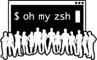
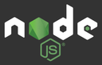

#MURG: MacOS Ultimate Reinstall Guide
===
####Latest update: 09/02/2017

My ultimate list for ***Don't Panic!*** when I've got to reinstall everything from scratch on a new mac or after a format.


##Package managers:

1. ###homebrew

	The missing macOS packager!

	

	[http://brew.sh/index_it.html](http://brew.sh/index_it.html)

	```/usr/bin/ruby -e "$(curl -fsSL https://raw.githubusercontent.com/Homebrew/install/master/install)"```
	
	Get info on package: ```brew info packagename```<br>
	Search pkgs: ```brew search packagename``` <br>
	Install pkgs: ```brew install packagename``` <br>
	Show installed pkgs: ```brew list``` <br>

2. ###homebrew cask

	For installing apps view brew.
	
	[https://caskroom.github.io](https://caskroom.github.io)

	```brew tap caskroom/cask```
	
##Command line tools:
1. ###wget

	```brew install wget```
	
2. ###git
	source control!
	
	```brew install git```
	
2. ###XCode command line tools
	1. check if xcode is installed:
		```xcode-select -p```	
	2. then
		```xcode-select --install```
	3. check if installation went good:
		```gcc --version```

##Shell:

1. ###oh-my-zsh

	

	[https://github.com/robbyrussell/oh-my-zsh](https://github.com/robbyrussell/oh-my-zsh)
	
	**via curl:**
	
	```sh -c "$(curl -fsSL https://raw.githubusercontent.com/robbyrussell/oh-my-zsh/master/tools/install.sh)"```
	
	**via wget:**
	
	```sh -c "$(wget https://raw.githubusercontent.com/robbyrussell/oh-my-zsh/master/tools/install.sh -O -)"```
	
	Theme: ```ZSH_THEME="zhann"```

##Text editor

1. ###Atom

	The open source hackable text editor for the 21st Century
	
	```brew cask install atom```
2. ###Visual Studio Code
	The closed source text editor from windows, but with great performance
	
	```brew cask install visual-studio-code```
	
##Javascript Dev:

1. ###Nodejs

	
	1. ```brew install node``` will install both node and npm
	2. check that node and npm are correctly installed:
	
		```node -v```
	
		```npm -v```
2. ###NodeJS version manager

	For easing switching between node versions, LTS, etc..
	
	[https://github.com/tj/n](https://github.com/tj/n)
	
	```npm install -g n```
	
##Utility

1. ###Dash

	
	
	Get offline access to 150+ API documentation sets.
	
	[https://kapeli.com/dash](https://kapeli.com/dash)
	
2. ###Imagemagick

	
	
	The all in 1 image manipulation software run from command line.
	
	```brew install imagemagick```
	
3. ###Crontab-UI

	A nice interface for managing cron jobs with crontab.
	
	[https://github.com/alseambusher/crontab-ui](https://github.com/alseambusher/crontab-ui)
	
	```npm install -g crontab-ui``` then to open it ```crontab-ui```
	
	
##Science&Math

1. ###Octave 

	
	
	First ```brew tap homebrew/science``` then you can ```brew install octave```
